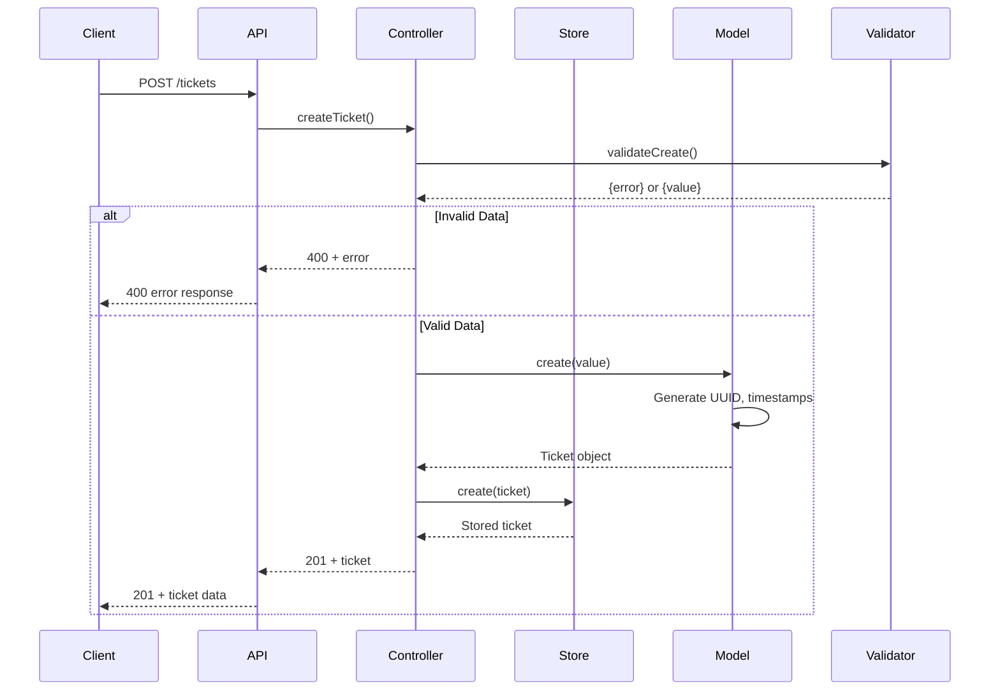
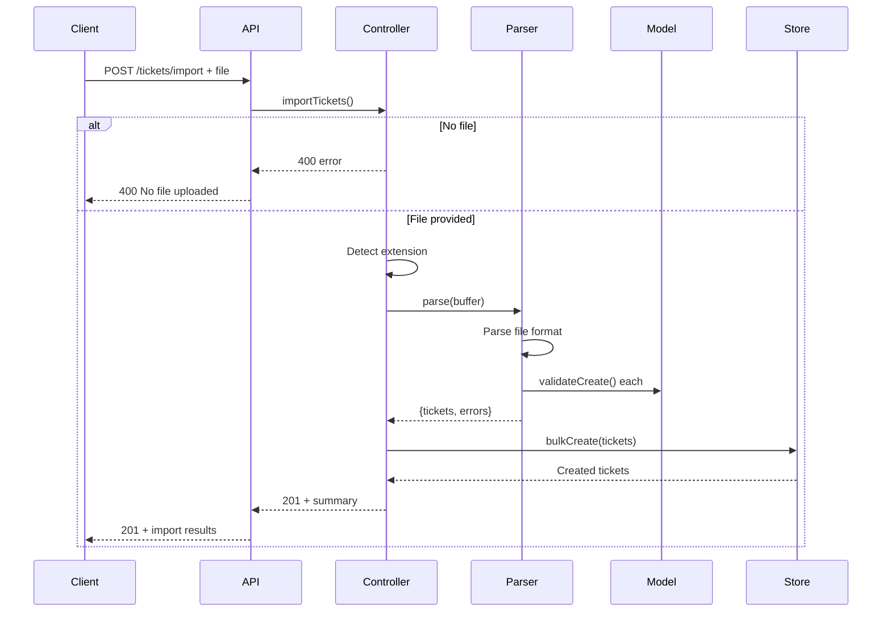
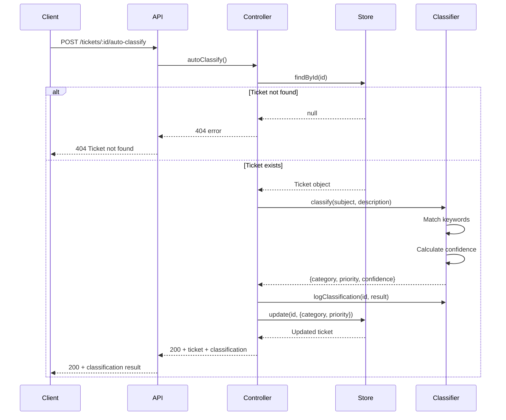

# Architecture Documentation

Detailed system architecture, component descriptions, and design decisions for the Customer Support Ticket Management System.

## High-Level Architecture

The system follows a layered architecture pattern with clear separation of concerns:

```
┌─────────────────────────────────────────────────────────────┐
│                        Client Layer                         │
│              (Web, Mobile, API Consumers)                   │
└────────────────────────┬────────────────────────────────────┘
                         │ HTTP/REST
┌────────────────────────▼────────────────────────────────────┐
│                      API Layer                              │
│                    (Express.js)                              │
│  ┌──────────────────────────────────────────────────────┐  │
│  │              Routes (tickets.ts)                      │  │
│  │  POST/GET/PUT/DELETE /tickets                         │  │
│  │  POST /tickets/import                                 │  │
│  │  POST /tickets/:id/auto-classify                      │  │
│  └──────────────────────────────────────────────────────┘  │
└────────────────────────┬────────────────────────────────────┘
                         │
┌────────────────────────▼────────────────────────────────────┐
│                   Controller Layer                          │
│              (ticketController.ts)                          │
│  - Request validation                                       │
│  - Business logic orchestration                             │
│  - Response formatting                                      │
└────────────────────────┬────────────────────────────────────┘
                         │
        ┌────────────────┼────────────────┐
        │                │                │
┌───────▼──────┐  ┌─────▼──────┐  ┌─────▼──────┐
│ Ticket Store │  │   Parsers  │  │ Classifier │
│ (Data Access)│  │ (Import)   │  │ (AI Logic) │
└──────────────┘  └────────────┘  └────────────┘
        │                │                │
┌───────▼────────────────▼────────────────▼──────────────────┐
│                    Model Layer                               │
│              (ticket.ts + Validation)                        │
│  - Joi schemas for validation                                │
│  - Business rules (timestamps, defaults)                     │
└──────────────────────────────────────────────────────────────┘
```

## Component Descriptions

### API Layer (`routes/tickets.ts`)

**Responsibilities:**
- Define REST API endpoints
- Configure middleware (file upload for `/import`)
- Route requests to appropriate controller methods

**Key Middleware:**
- `multer.memoryStorage()` - Stores uploaded files in memory for parsing

### Controller Layer (`controllers/ticketController.ts`)

**Responsibilities:**
- Validate incoming request data using Joi schemas
- Orchestrate business operations
- Handle error responses
- Format HTTP responses

**Methods:**
- `createTicket` - Validates and creates new tickets
- `getTickets` - Applies filters and returns ticket list
- `getTicketById` - Retrieves single ticket or 404
- `updateTicket` - Validates updates and modifies ticket
- `deleteTicket` - Removes ticket or returns 404
- `importTickets` - Routes file to appropriate parser based on extension
- `autoClassify` - Applies AI classification and updates ticket

### Service Layer

#### TicketStore (`services/ticketStore.ts`)

**Responsibilities:**
- In-memory data storage using `Map<string, Ticket>`
- CRUD operations on ticket data
- Filtering by category, priority, status, customer_id
- Bulk creation operations

**Design Decision:**
- In-memory storage chosen for simplicity and performance in this homework context
- For production, this would be replaced with a database (PostgreSQL, MongoDB)

#### Parsers (`services/*Parser.ts`)

**CsvParser:**
- Parses CSV files with header row
- Normalizes field names (camelCase/snake_case)
- Splits tags by semicolon
- Handles validation errors per row

**JsonParser:**
- Handles both array and single object inputs
- Normalizes field names for consistency
- Validates each ticket individually

**XmlParser:**
- Uses `xml2js` for XML parsing
- Handles both `<tickets>` and `<ticket>` root elements
- Supports multiple tag formats (string, array, child elements)
- Extracts metadata from nested or root-level fields

#### Classifier (`services/classifier.ts`)

**Responsibilities:**
- Keyword-based ticket categorization
- Priority assignment based on keywords
- Confidence scoring
- Classification logging for audit trail

**Algorithm:**
- Matches keywords against subject and description
- Calculates confidence based on keyword count and position
- Returns category, priority, and confidence score

### Model Layer (`models/ticket.ts`)

**Responsibilities:**
- Define Joi validation schemas
- Implement business rules (defaults, timestamps)
- Handle metadata merging on updates
- Set `resolved_at` when status changes to resolved/closed

**Validation Rules:**
- Email format validation
- Subject length: 1-200 characters
- Description length: 10-2000 characters
- Enum validation for category, priority, status, source, device_type

## Sequence Diagrams

### Create Ticket Flow



### Import Tickets Flow



### Auto-Classify Flow



## Design Decisions

### 1. In-Memory Storage

**Decision:** Use `Map<string, Ticket>` for ticket storage instead of a database.

**Rationale:**
- Simplicity for homework context
- Fast in-memory operations
- No external dependencies
- Easy to reset between tests

**Trade-offs:**
- Data is lost on server restart
- Not suitable for production
- Limited scalability

### 2. Keyword-Based Classification

**Decision:** Use simple keyword matching for auto-classification instead of ML models.

**Rationale:**
- No external ML dependencies
- Deterministic behavior for testing
- Easy to understand and maintain
- Sufficient for demonstration

**Trade-offs:**
- Limited accuracy compared to ML
- Requires manual keyword maintenance
- No learning capability

### 3. Joi for Validation

**Decision:** Use Joi schema validation instead of custom validation.

**Rationale:**
- Declarative validation rules
- Built-in error messages
- Type-safe with TypeScript
- Widely adopted in Node.js ecosystem

### 4. File Upload via Multer Memory Storage

**Decision:** Store uploaded files in memory instead of disk.

**Rationale:**
- No disk I/O overhead
- Automatic cleanup after request
- Simplifies testing
- Suitable for small import files

**Trade-offs:**
- Not suitable for very large files
- Higher memory usage during import

### 5. Separate Parser Classes

**Decision:** Create separate classes for CSV, JSON, and XML parsing.

**Rationale:**
- Single Responsibility Principle
- Easy to add new formats
- Independent testing
- Clear separation of concerns

### 6. Controller Validation

**Decision:** Validate in controller layer, not in routes or models.

**Rationale:**
- Centralized validation logic
- Reusable validation schemas
- Clear error handling
- Separation from HTTP concerns

### 7. Timestamp Management in Model

**Decision:** Handle timestamps in Model layer, not Controller.

**Rationale:**
- Business logic belongs in domain layer
- Consistent timestamp handling
- Controller focuses on HTTP concerns
- Easier to test business rules

### 8. Metadata Merging

**Decision:** Merge metadata on update rather than replace.

**Rationale:**
- Preserves existing metadata fields
- Allows partial updates
- More flexible for consumers
- Follows PATCH semantics

## Technology Stack

| Layer | Technology | Purpose |
|-------|-----------|---------|
| Web Framework | Express.js | HTTP server and routing |
| Language | TypeScript | Type safety and developer experience |
| Validation | Joi | Schema validation |
| File Upload | Multer | Multipart form data handling |
| CSV Parsing | csv-parser | CSV to JSON conversion |
| XML Parsing | xml2js | XML to JSON conversion |
| UUID Generation | uuid | Unique ticket IDs |
| Testing | Jest + Supertest | Unit and integration tests |
| Build Tool | TypeScript Compiler | TS to JS transpilation |

## Scalability Considerations

### Current Limitations

- **In-memory storage**: Limited by available RAM
- **Single-threaded**: Node.js event loop, no clustering
- **No caching**: Every request processes data
- **No rate limiting**: Vulnerable to abuse

### Production Improvements

1. **Database**: Replace `TicketStore` with PostgreSQL or MongoDB
2. **Caching**: Add Redis for frequently accessed tickets
3. **Queue**: Use Bull/RabbitMQ for background import processing
4. **Clustering**: Use Node.js cluster module or PM2
5. **Rate Limiting**: Add express-rate-limit middleware
6. **Pagination**: Implement cursor-based pagination for GET /tickets
7. **ML Classification**: Replace keyword matching with trained ML model
8. **Search**: Add Elasticsearch for full-text search
9. **Authentication**: Add JWT-based auth
10. **Audit Logging**: Persist classification logs to database

## Security Considerations

### Current Implementation

- Input validation via Joi
- File upload size limits (Multer config)
- Type safety via TypeScript

### Recommended Enhancements

1. **Authentication**: Add JWT or OAuth2
2. **Authorization**: Role-based access control
3. **Rate Limiting**: Prevent abuse
4. **Input Sanitization**: Prevent XSS
5. **File Validation**: Verify file types, scan for malware
6. **CORS**: Configure cross-origin restrictions
7. **Helmet**: Security headers middleware
8. **Logging**: Security event logging
9. **HTTPS**: Enforce TLS in production
10. **Secret Management**: Environment variables for secrets
