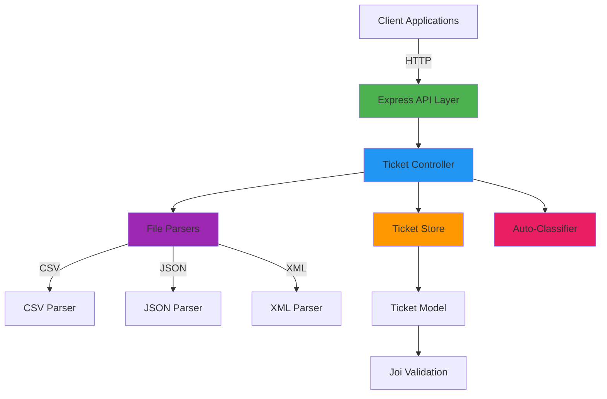

# Customer Support Ticket Management System

An intelligent customer support ticket management system built with Express.js, TypeScript, and Node.js. The system provides RESTful APIs for ticket management, multi-format data import (CSV, JSON, XML), and AI-powered auto-classification.

## Features

- **Ticket Management**: Create, read, update, and delete support tickets
- **Multi-Format Import**: Bulk import tickets from CSV, JSON, or XML files
- **Auto-Classification**: AI-powered keyword-based ticket categorization and priority assignment
- **Filtering**: Filter tickets by category, priority, status, and customer ID
- **Validation**: Comprehensive input validation using Joi
- **In-Memory Storage**: Fast, in-memory ticket store with full CRUD operations
- **Comprehensive Testing**: 75+ tests with 93.93% code coverage

## Architecture



## Project Structure

```
homework-2/
├── src/
│   ├── controllers/      # Request handlers
│   ├── middleware/       # Error handling middleware
│   ├── models/           # Data models and validation
│   ├── routes/           # API route definitions
│   ├── services/         # Business logic (parsers, classifier, store)
│   ├── tests/            # Test files and fixtures
│   │   └── fixtures/     # Sample data files (50 CSV, 20 JSON, 30 XML)
│   ├── types/            # TypeScript type definitions
│   ├── utils/            # Utility functions
│   ├── app.ts            # Express app configuration
│   ├── index.ts          # Application entry point
│   ├── jest.config.ts    # Jest test configuration
│   ├── package.json      # Dependencies and scripts
│   └── tsconfig.json     # TypeScript configuration
└── docs/                 # Documentation
    ├── README.md         # This file
    ├── API_REFERENCE.md  # API endpoint documentation
    ├── ARCHITECTURE.md   # System architecture details
    └── TESTING_GUIDE.md  # Testing guide and benchmarks
```

## Setup Instructions

### Prerequisites

- Node.js (v18 or higher)
- npm or yarn

### Installation

1. Navigate to the project directory:
   ```bash
   cd /Users/admin/CascadeProjects/gen-ai-software-engineering/homework-2/src
   ```

2. Install dependencies:
   ```bash
   npm install
   ```

### Running the Application

#### Development Mode (with auto-reload)
```bash
npm run dev
```
The server will start on `http://localhost:3000` and automatically reload on file changes.

#### Production Build
```bash
npm run build
npm start
```

## Running Tests

### Run All Tests
```bash
npm test
```

### Run Tests in Watch Mode
```bash
npm run test:watch
```

### Run Tests with Coverage Report
```bash
npm test -- --coverage
```

Coverage reports are generated in the `coverage/` directory.

## API Endpoints

| Method | Endpoint | Description |
|--------|----------|-------------|
| POST | `/tickets` | Create a new ticket |
| POST | `/tickets/import` | Bulk import tickets from file (CSV/JSON/XML) |
| GET | `/tickets` | List all tickets (with optional filters) |
| GET | `/tickets/:id` | Get a specific ticket by ID |
| PUT | `/tickets/:id` | Update a ticket |
| DELETE | `/tickets/:id` | Delete a ticket |
| POST | `/tickets/:id/auto-classify` | Auto-classify a ticket using AI |

For detailed API documentation with examples, see [API_REFERENCE.md](./API_REFERENCE.md).

## Ticket Categories

- `account_access` - Login, password, account access issues
- `technical_issue` - Bugs, crashes, technical problems
- `billing_question` - Payments, invoices, subscriptions
- `feature_request` - New feature suggestions
- `bug_report` - Software bug reports
- `other` - General inquiries

## Priority Levels

- `urgent` - Critical issues requiring immediate attention
- `high` - Important issues affecting user experience
- `medium` - Standard issues
- `low` - Minor issues or enhancements

## Status Values

- `new` - Newly created ticket
- `in_progress` - Currently being worked on
- `waiting_customer` - Awaiting customer response
- `resolved` - Issue resolved
- `closed` - Ticket closed

## Sample Data

The project includes sample data files in `src/tests/fixtures/`:

- `sample_tickets.csv` - 50 sample tickets in CSV format
- `sample_tickets.json` - 20 sample tickets in JSON format
- `sample_tickets.xml` - 30 sample tickets in XML format
- `invalid_tickets.csv/json/xml` - Invalid data for testing error handling

## Test Coverage

- **Total Coverage**: 93.93%
- **Test Suites**: 7 passed
- **Total Tests**: 75 passed

For detailed testing information, see [TESTING_GUIDE.md](./TESTING_GUIDE.md).

## Dependencies

### Runtime
- `express` - Web framework
- `uuid` - Unique ID generation
- `joi` - Data validation
- `multer` - File upload handling
- `csv-parser` - CSV parsing
- `xml2js` - XML parsing

### Development
- `typescript` - TypeScript compiler
- `ts-node` - TypeScript runtime
- `jest` - Testing framework
- `ts-jest` - TypeScript preprocessor for Jest
- `supertest` - HTTP assertion library
- `nodemon` - Development auto-reload

## License

ISC

## Author

Mykola Bernadskyi
