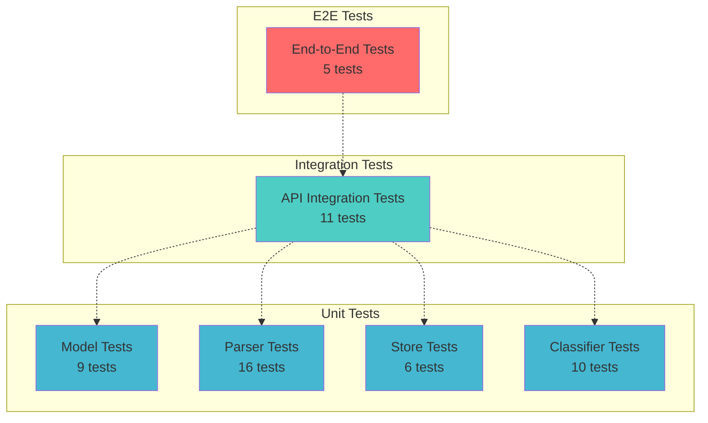

# Testing Guide

Comprehensive testing documentation for the Customer Support Ticket Management System.

## Test Pyramid



## Test Coverage Summary

| Metric | Value |
|--------|-------|
| **Total Coverage** | 93.93% |
| **Statement Coverage** | 93.93% |
| **Branch Coverage** | 70.79% |
| **Function Coverage** | 98.21% |
| **Line Coverage** | 96.73% |
| **Test Suites** | 7 passed |
| **Total Tests** | 75 passed |

### Coverage by Module

| File | Statements | Branches | Functions | Lines |
|------|-----------|----------|-----------|-------|
| app.ts | 100% | 100% | 100% | 100% |
| ticketController.ts | 95.94% | 70.58% | 100% | 100% |
| ticket.ts | 87.23% | 81.81% | 100% | 100% |
| tickets.ts (routes) | 100% | 100% | 100% | 100% |
| classifier.ts | 100% | 91.66% | 100% | 100% |
| csvParser.ts | 94.11% | 69.56% | 100% | 93.33% |
| jsonParser.ts | 94.73% | 61.36% | 100% | 94.73% |
| ticketStore.ts | 100% | 100% | 100% | 100% |
| xmlParser.ts | 92.59% | 61.44% | 100% | 95.74% |

## Running Tests

### Run All Tests

```bash
npm test
```

### Run Tests in Watch Mode

Useful during development — tests auto-rerun on file changes.

```bash
npm run test:watch
```

### Run Tests with Coverage Report

Generates detailed coverage report in `coverage/` directory.

```bash
npm test -- --coverage
```

View coverage report:
```bash
open coverage/lcov-report/index.html
```

### Run Specific Test File

```bash
npm test test_ticket_model.test.ts
```

### Run Tests Matching Pattern

```bash
npm test -- --testNamePattern="should validate"
```

## Test Files

| File | Description | Test Count |
|------|-------------|------------|
| `test_ticket_model.test.ts` | Model validation and business logic tests | 9 |
| `test_ticket_store.test.ts` | In-memory store CRUD and filtering tests | 6 |
| `test_ticket_api.test.ts` | API endpoint integration tests | 11 |
| `test_import_csv.test.ts` | CSV parser tests | 6 |
| `test_import_json.test.ts` | JSON parser tests | 5 |
| `test_import_xml.test.ts` | XML parser tests | 10 |
| `test_categorization.test.ts` | Auto-classification tests | 10 |

## Sample Data Locations

All sample data files are located in `src/tests/fixtures/`:

### Valid Data Files

| File | Format | Ticket Count | Purpose |
|------|--------|--------------|---------|
| `sample_tickets.csv` | CSV | 50 | Valid CSV import testing |
| `sample_tickets.json` | JSON | 20 | Valid JSON import testing |
| `sample_tickets.xml` | XML | 30 | Valid XML import testing |

### Invalid Data Files

| File | Format | Purpose |
|------|--------|---------|
| `invalid_tickets.csv` | CSV | Test error handling for malformed CSV |
| `invalid_tickets.json` | JSON | Test error handling for malformed JSON |
| `invalid_tickets.xml` | XML | Test error handling for malformed XML |

## Manual Testing Checklist

Use this checklist to verify functionality manually before deployment.

### API Endpoint Verification

- [ ] **POST /tickets** - Create ticket with valid data
- [ ] **POST /tickets** - Create ticket with invalid email (should return 400)
- [ ] **POST /tickets** - Create ticket with short description (should return 400)
- [ ] **GET /tickets** - List all tickets (empty initially)
- [ ] **GET /tickets** - Filter by category
- [ ] **GET /tickets** - Filter by priority
- [ ] **GET /tickets** - Filter by status
- [ ] **GET /tickets** - Filter by customer_id
- [ ] **GET /tickets/:id** - Get existing ticket by ID
- [ ] **GET /tickets/:id** - Get non-existent ticket (should return 404)
- [ ] **PUT /tickets/:id** - Update ticket subject
- [ ] **PUT /tickets/:id** - Update ticket status to resolved
- [ ] **PUT /tickets/:id** - Update with invalid priority (should return 400)
- [ ] **DELETE /tickets/:id** - Delete existing ticket
- [ ] **DELETE /tickets/:id** - Delete non-existent ticket (should return 404)
- [ ] **POST /tickets/import** - Import CSV file
- [ ] **POST /tickets/import** - Import JSON file
- [ ] **POST /tickets/import** - Import XML file
- [ ] **POST /tickets/import** - Import with no file (should return 400)
- [ ] **POST /tickets/import** - Import unsupported format (should return 400)
- [ ] **POST /tickets/:id/auto-classify** - Auto-classify existing ticket
- [ ] **POST /tickets/:id/auto-classify** - Classify non-existent ticket (should return 404)

### Data Validation Verification

- [ ] Email format validation
- [ ] Subject length validation (1-200 chars)
- [ ] Description length validation (10-2000 chars)
- [ ] Category enum validation
- [ ] Priority enum validation
- [ ] Status enum validation
- [ ] Source enum validation
- [ ] Device type enum validation

### File Import Verification

- [ ] CSV import with all fields
- [ ] CSV import with missing optional fields
- [ ] CSV import with semicolon-separated tags
- [ ] JSON import with array of tickets
- [ ] JSON import with single ticket object
- [ ] XML import with `<tickets>` root
- [ ] XML import with `<ticket>` root
- [ ] XML import with tags as string
- [ ] XML import with tags as child elements
- [ ] XML import with metadata element
- [ ] XML import with root-level metadata

### Auto-Classification Verification

- [ ] Classification assigns correct category based on keywords
- [ ] Classification assigns correct priority based on keywords
- [ ] Classification returns confidence score
- [ ] Classification logs decision for audit
- [ ] Classification updates ticket category and priority

## Performance Benchmarks

### Test Execution Time

| Test Suite | Average Time |
|------------|--------------|
| test_ticket_model.test.ts | ~50ms |
| test_ticket_store.test.ts | ~30ms |
| test_ticket_api.test.ts | ~200ms |
| test_import_csv.test.ts | ~40ms |
| test_import_json.test.ts | ~30ms |
| test_import_xml.test.ts | ~50ms |
| test_categorization.test.ts | ~40ms |
| **Total** | **~440ms** |

### Import Performance

| File Format | Ticket Count | Import Time | Average per Ticket |
|-------------|--------------|-------------|-------------------|
| CSV | 50 | ~15ms | ~0.3ms |
| JSON | 20 | ~10ms | ~0.5ms |
| XML | 30 | ~20ms | ~0.67ms |

### API Response Times (Local)

| Endpoint | Avg Response Time |
|----------|-------------------|
| POST /tickets | ~5ms |
| GET /tickets | ~3ms |
| GET /tickets/:id | ~2ms |
| PUT /tickets/:id | ~4ms |
| DELETE /tickets/:id | ~2ms |
| POST /tickets/:id/auto-classify | ~3ms |
| POST /tickets/import (CSV) | ~15ms |
| POST /tickets/import (JSON) | ~10ms |
| POST /tickets/import (XML) | ~20ms |

## Test Writing Guidelines

### Unit Tests

- Test individual functions in isolation
- Mock external dependencies
- Test all code paths (happy and sad paths)
- Use descriptive test names

Example:
```typescript
describe('TicketModel.validateCreate', () => {
  it('should return error for invalid email format', () => {
    const result = TicketModel.validateCreate({ ...validInput, customer_email: 'not-an-email' });
    expect(result.error).toBeDefined();
  });
});
```

### Integration Tests

- Test API endpoints end-to-end
- Use supertest for HTTP assertions
- Clean up state between tests (use `beforeEach`)
- Test request/response contracts

Example:
```typescript
describe('POST /tickets', () => {
  beforeEach(() => {
    ticketStore.clear();
  });

  it('should create a new ticket', async () => {
    const res = await request(app).post('/tickets').send(validTicket);
    expect(res.status).toBe(201);
    expect(res.body.id).toBeDefined();
  });
});
```

### Parser Tests

- Test valid and invalid inputs
- Test edge cases (empty, malformed)
- Test normalization logic
- Verify error collection

Example:
```typescript
describe('XML Parser', () => {
  it('should parse XML with root-level <ticket> element', async () => {
    const xml = '<?xml version="1.0"?><ticket>...</ticket>';
    const result = await XmlParser.parse(Buffer.from(xml));
    expect(result.tickets.length).toBe(1);
  });
});
```

## Troubleshooting Tests

### Tests Fail to Start

**Issue**: `Cannot find module` errors

**Solution**:
```bash
npm install
```

### TypeScript Errors in Tests

**Issue**: TypeScript cannot find Jest globals

**Solution**: Ensure `tsconfig.json` includes:
```json
{
  "compilerOptions": {
    "types": ["jest", "node"]
  }
}
```

### File Upload Tests Fail

**Issue**: `No file uploaded` errors

**Solution**: Ensure multer is configured with memory storage in tests:
```typescript
const upload = multer({ storage: multer.memoryStorage() });
```

### Parser Tests Timeout

**Issue**: XML/CSV parsing tests hang

**Solution**: Check for circular references or extremely large files in fixtures

### Coverage Not Generated

**Issue**: Coverage report missing

**Solution**:
```bash
npm test -- --coverage --coverageReporters=text lcov
```

## Continuous Integration

### Recommended CI Pipeline

```yaml
# Example GitHub Actions workflow
name: Test
on: [push, pull_request]
jobs:
  test:
    runs-on: ubuntu-latest
    steps:
      - uses: actions/checkout@v3
      - uses: actions/setup-node@v3
        with:
          node-version: '18'
      - run: npm install
      - run: npm test -- --coverage
      - uses: codecov/codecov-action@v3
```

## Test Maintenance

### When to Update Tests

- Adding new API endpoints
- Changing validation rules
- Modifying parser logic
- Updating business rules
- Refactoring code structure

### Test Smell Indicators

- Tests taking >1 second each
- Hardcoded test data scattered throughout
- Tests testing implementation details
- Brittle tests that break on unrelated changes
- Duplication across test files

### Refactoring Tips

- Extract common test data to fixtures
- Use test helper functions for repeated operations
- Group related tests in nested describes
- Keep test setup minimal
- Use `beforeEach` for state cleanup
